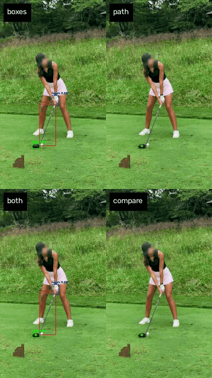
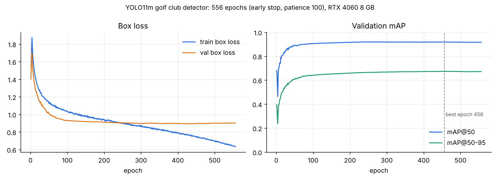

<h1 align="center">⛳ SwingTrace</h1>

<p align="center"><b>Open-source golf swing tracer. Drop in any phone video, get the club path.</b></p>

<p align="center">
  <a href="https://huggingface.co/spaces/nishsm/swingtrace"></a>
  <a href="https://huggingface.co/nishsm/swingtrace"></a>
  <a href="https://colab.research.google.com/github/nishsm/swingtrace/blob/main/notebooks/swingtrace_quickstart.ipynb"></a>
  
  
</p>

<p align="center">
  
</p>
<p align="center"><sub><b>boxes</b> shaft, head and hands · <b>path</b> reconstructed club-head path · <b>both</b> · <b>compare</b> raw detections (yellow) vs smoothed path (green). Face blurred for privacy.</sub></p>

SwingTrace finds the **club shaft, club head and hands** in every frame and rebuilds the **club-head path through the whole swing**, including the top of the backswing and impact, where the head turns into a blur and normal detectors lose it.

- 🎯 **Tracks the club in 93% of frames** on phone videos it has never seen ([how this is measured](#-how-good-is-it))
- 📱 **One phone camera.** No sensors, no launch monitor, no markers.
- ⚡ **Runs on a laptop.** CPU, NVIDIA GPU or Apple silicon (`--device mps`).
- 🆓 **Free and open:** the weights, the code, the training setup and the evaluation are all here.

## 🚀 Try it in 10 seconds

**In your browser:** upload a swing on the [live demo](https://huggingface.co/spaces/nishsm/swingtrace). No install needed.

**On your machine:**

```bash
pip install git+https://github.com/nishsm/swingtrace.git
swingtrace my_swing.mp4                # boxes + club path → out/my_swing_both.mp4
swingtrace my_swing.mp4 --mode all     # all four modes
```

The model weights (40 MB) download automatically from [Hugging Face](https://huggingface.co/nishsm/swingtrace) the first time you run it.

**From Python:**

```python
import swingtrace

result = swingtrace.track("my_swing.mp4", mode="path", device="mps")
print(result.summary())   # frames with a head detection, frames filled from the shaft, path length
```

### Modes

| Mode | What you get |
|---|---|
| `both` (default) | Boxes for shaft, head and hands, plus the club-head path |
| `path` | Just the smoothed club-head path |
| `boxes` | Just the detections |
| `compare` | Raw detections (yellow) next to the smoothed path (green), to see what the reconstruction adds |

Tips for best results: one golfer, a full swing, a phone on a tripod or held still, filmed face-on or from behind the golfer.

## 📊 How good is it?

**On 7 unseen phone videos (3,018 frames):**

| | Share of frames |
|---|---|
| Club head detected directly | **71.6%** |
| Head **or** shaft detected, so the head can be recovered from the shaft | **93.4%** |

<details>
<summary>Per-video results and caveats</summary>

| Video | Frames | Head | Head or shaft | Longest head gap (frames) |
|---|---|---|---|---|
| Indoor studio, face-on* | 644 | 48.4% | 99.4% | 62 |
| Range 1 | 278 | 37.8% | 86.0% | 49 |
| Range 2 | 399 | 89.0% | 95.2% | 11 |
| Range 3 | 527 | 87.7% | 92.8% | 19 |
| Range 4 | 468 | 87.4% | 96.8% | 14 |
| Simulator bay | 391 | 71.4% | 84.1% | 40 |
| Outdoor, backlit | 311 | 77.2% | 92.9% | 20 |

\*The model also boxes a ceiling light as a shaft in this video, so its head-or-shaft figure is inflated. "Detected" means a box above confidence 0.5. These videos have no hand labels, so the counts include the occasional false positive. Raw numbers are in [`results/video_eval.csv`](results/video_eval.csv). To reproduce on your own clips: `python evaluate.py --videos your_folder/`.

</details>

**Validation set:** precision 0.930 · recall 0.849 · **mAP@50 0.918** · mAP@50-95 0.674 (YOLO11m, 640 px, best of 556 epochs).

I treat that number as an upper bound, not a headline. The dataset is frames from swing videos split at random, and 91% of validation frames have a near-identical neighbour within 2 frames in the training set. That's why the unseen-video test above exists.

<details>
<summary>Training curves</summary>



About 48 hours on a laptop RTX 4060 (8 GB): batch 2, mixed precision, early stopping with patience 100. Full history in [`results/training_history.json`](results/training_history.json).

</details>

## 🧠 How it works

```
video ──► YOLO11m (shaft / head / hands) ──► per-frame boxes
                                                │
                head missed, shaft found? ──────┤  estimate head = shaft-box corner
                                                │  nearest the last known head
                                                ▼
                         cubic spline over frame index (fills remaining gaps)
                                                ▼
                         moving-average smoothing (5 frames)
                                                ▼
                         club path drawn on the video
```

1. **Detect.** A YOLO11m fine-tuned on the open [golf-club-tracking dataset](https://universe.roboflow.com/club-head-tracking/golf-club-tracking) (CC BY 4.0) finds the shaft, club head and hands.
2. **Recover.** The head is small and moves fastest at the top and at impact, so that's where detection drops out. The shaft is bigger and easier to see. When only the shaft is found, the head is placed at the corner of the shaft box closest to where the head was last seen.
3. **Fill and smooth.** A cubic spline bridges the remaining gaps, and a moving average smooths the result into one continuous path.

## 🛠️ More

<details>
<summary>Run from a clone, hosted model, retraining, demo GIFs</summary>

```bash
git clone https://github.com/nishsm/swingtrace.git && cd swingtrace
pip install -e ".[dev]"
pytest                                     # trajectory unit tests
python evaluate.py --videos path/to/swings # per-video coverage report
```

**Hosted model (Roboflow):** `pip install "swingtrace[roboflow]"`, set `ROBOFLOW_API_KEY`, then `swingtrace swing.mp4 --backend roboflow`.

**Retrain:** export the dataset from Roboflow in YOLOv11 format into `data/`, then `python train.py --data data/data.yaml --device 0`.

**Make the 2×2 demo GIF** (needs ffmpeg):
```bash
swingtrace swing.mp4 --mode all
python scripts/make_grid.py out/swing assets/modes_grid.gif
```

**Layout**
```
src/swingtrace/   package: detect.py, trajectory.py, render.py, cli.py, weights.py
evaluate.py       per-video coverage on unseen swings
train.py          YOLO11 fine-tuning with the settings used for the released weights
scripts/          make_grid.py (demo GIF)
notebooks/        Colab quickstart
hf/               Hugging Face model card and Space app
tests/            pytest
```

</details>

## 🗺️ Roadmap

- [ ] Cut the path off when the swing ends, instead of tracing the walk-off
- [ ] Swing metrics from the path: tempo, swing plane, club speed estimate
- [ ] Live tracking with a Kalman filter in place of offline splines
- [ ] ONNX / CoreML export for on-phone use
- [ ] Ball tracking (see [golf-ball-tracking](https://github.com/nishsm/golf-ball-tracking))

## ⚠️ Limitations

- Built for one golfer and one swing per clip, from a static camera. Moving cameras and multiple people haven't been tested.
- The shaft-corner estimate breaks down when the shaft is close to vertical or horizontal.
- All frames are held in memory for the drawing pass. That's fine for swing clips, but not for long videos.

## 🙌 Credits

- Dataset: [golf-club-tracking](https://universe.roboflow.com/club-head-tracking/golf-club-tracking) by club-head-tracking on Roboflow Universe, CC BY 4.0.
- Base model: [Ultralytics YOLO11](https://github.com/ultralytics/ultralytics).

If SwingTrace is useful to you, a ⭐ helps other people find it. Issues and PRs are welcome, especially clips where it fails.

## License

AGPL-3.0, following Ultralytics YOLO, which the weights are fine-tuned from.
